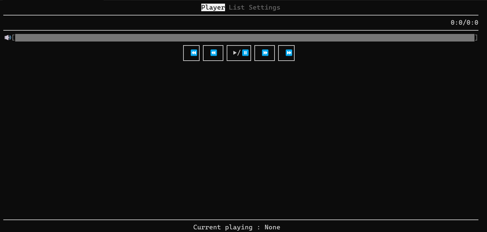
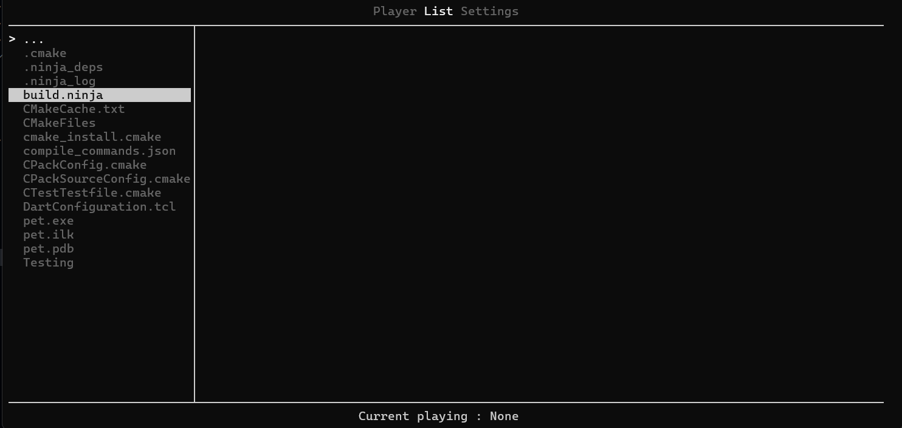

# TUI AudioPlayer

A terminal-based audio player written in C++20. It uses [FTXUI](https://github.com/ArthurSonzogni/FTXUI) for the interface and [miniaudio](https://github.com/mackron/miniaudio) for audio playback.

## Features

- Browse directories from the terminal interface
- Add audio files to a playlist
- Play, pause, stop, and switch tracks
- Seek forward and backward by a configurable skip interval
- Adjust volume from 0 to 100
- Playback modes:
	- Normal
	- Loop playlist
	- Shuffle
	- Loop track
- Configure output sample rate and channel count
- Optional autoplay when the first track is added

## Requirements

- CMake 3.25 or newer
- A C++20 compiler
- Internet access during the first CMake configure, so FetchContent can download FTXUI and miniaudio


## Usage


The interface contains three tabs:


- **Player**: volume, playback controls, track progress, and elapsed time

- **List**: directory browser and playlist

- **Settings**: autoplay, playback mode, sample rate, and output channels


Use the arrow keys to move between controls and press Enter to activate the focused menu item or button. In the file list, select a directory to open it or an audio file to add it to the playlist.

## Dependencies

Dependencies are downloaded automatically by CMake into `ThirdParty/`:

- FTXUI for terminal rendering and input handling
- miniaudio for decoding and playback

No separate package manager is required.

## Project Layout

```text
main.cpp          Application entry point
Src/Player.*      Audio engine and playback control
Src/Screen.*      FTXUI interface and playlist interaction
CMakeLists.txt    CMake project definition
```

## License

This project is distributed under the terms of the [LICENSE](LICENSE) file.
